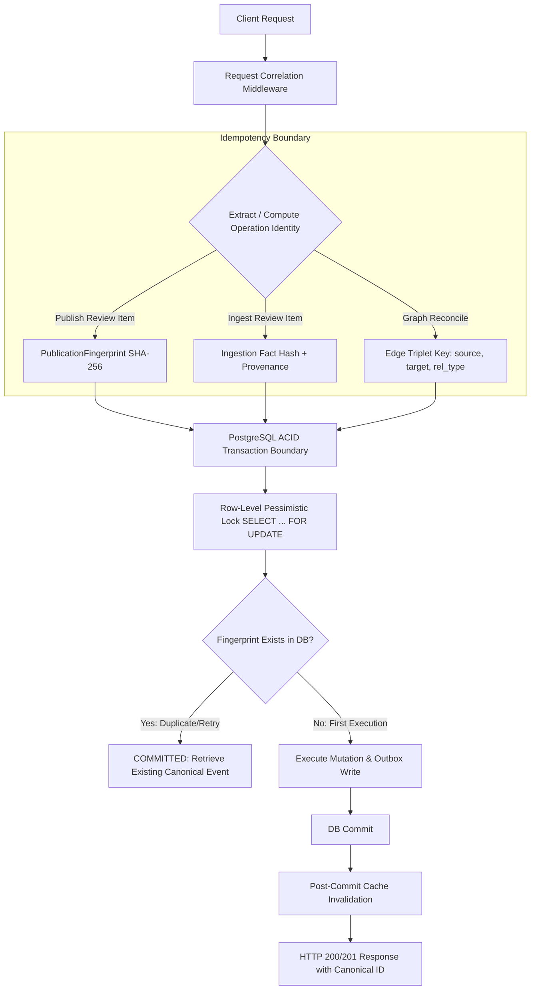
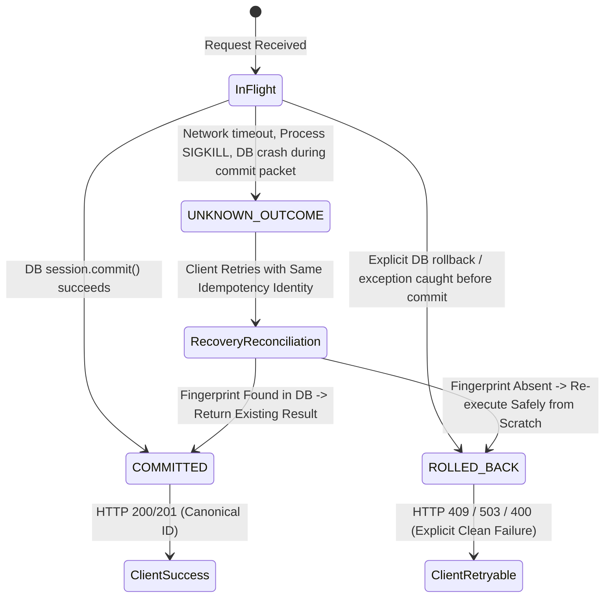
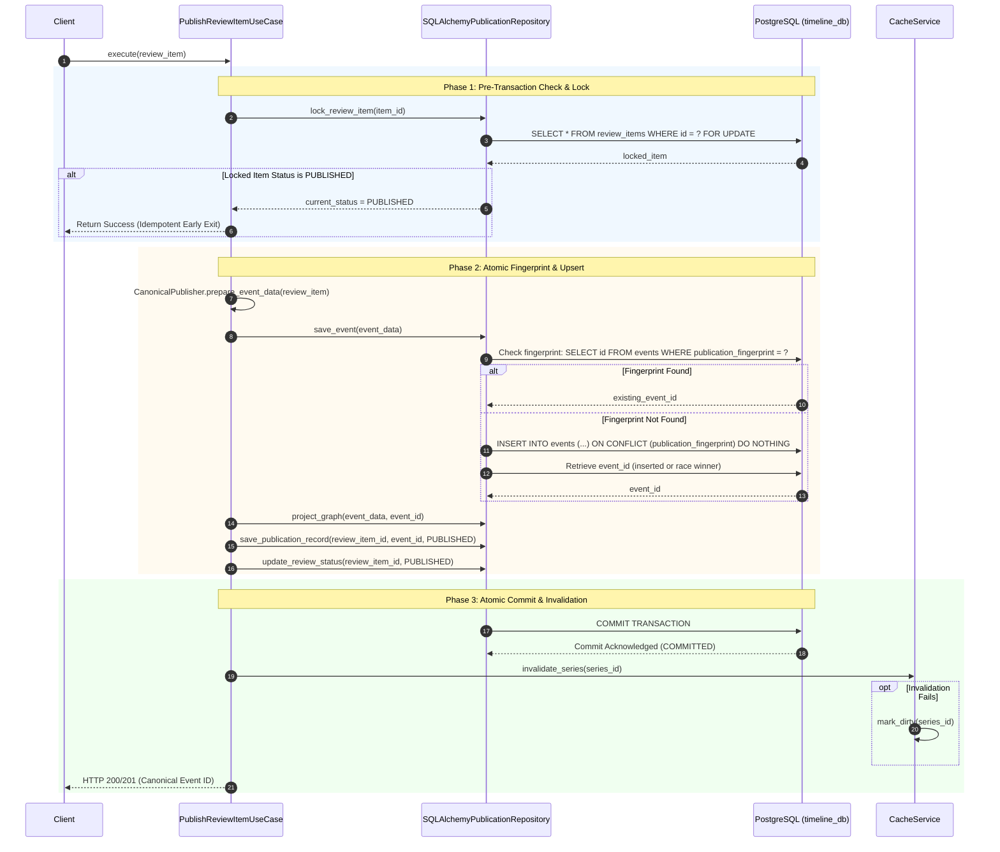
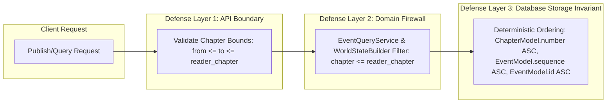

# Phase 4.11 — Failure Recovery and Idempotency Architecture Decision

## 1. Executive Summary & Architectural Context

This document defines the **Failure Recovery and Idempotency Architecture** for the **Timeline Power Visualizer** platform, directly building upon the empirical failure inventory established in `docs/phase_4_11_failure_inventory.md`.

### Core Architectural Constraints & Environment Realities
1. **Zero External Distributed Middleware**: In strict adherence to project constraints and empirical repository evidence, this design **does NOT introduce** Redis, Celery, RabbitMQ, Kafka, distributed locks (e.g., Redlock, Consul), or external background worker daemons. 
2. **Single-Worker Concurrency (`WORKER_COUNT=1`)**: As verified in configuration (`CACHE_ENABLED` is active only when `WORKER_COUNT=1`), in-process concurrency is driven by thread pools and cooperative async I/O, backed by a single authoritative PostgreSQL database instance.
3. **Storage Authority**: PostgreSQL is the single source of truth (SSoT). All state transitions, serialization locks, idempotency keys, and reconciliation outboxes reside exclusively within PostgreSQL ACID boundaries.
4. **Resilience Mandate**: Every mutating operation must possess a deterministic, provable recovery strategy under all failure classifications (client timeouts, network partitions, query timeouts, deadlocks, and sudden OS/process crashes).

---

## 2. Operation Identity & Idempotency Boundary

To guarantee that duplicate or retried requests never cause duplicate side effects, each critical mutation across the system is bounded by an explicit **Operation Identity** and an immutable **Idempotency Boundary**.



### 2.1 Critical Mutation Identity Matrix

| Mutating Operation | Operation Identity Construct | Identity Derivation Formula / Token | Storage / Index Enforcement | Idempotency Scope |
| :--- | :--- | :--- | :--- | :--- |
| **Publish Review Item** (`PublishReviewItemUseCase`) | `PublicationFingerprint` (SHA-256 Hex) | `SHA256(series_id \| chapter_id \| event_type \| subject_id \| target_id \| canonical_json(payload))` | `EventModel.publication_fingerprint` with `UNIQUE CONSTRAINT (publication_fingerprint)` | Global per Series + Event Semantic Content |
| **Review Ingestion** (`IngestReviewItemUseCase`) | `IngestionFingerprint` (SHA-256 Hex) | `SHA256(series_id \| chapter_id \| fact_type \| raw_fact_hash \| provenance_token)` | `ReviewItemModel` partial index / constraint: `(series_id, fact_hash) WHERE status IN ('PENDING', 'APPROVED')` | Series + Chapter + Fact Content |
| **Canonical Graph Projection** (`GraphProjectionService`) | `CanonicalEdgeKey` | `(series_id, source_entity_id, target_entity_id, relationship_type, event_id)` | `CanonicalRelationshipModel` unique index or entity upsert: `(series_id, id)` via `ON CONFLICT DO NOTHING` | Event-scoped Edge Projection |
| **Entity Registration** (`ensure_entity_exists`) | `EntityKey` | `(series_id, entity_id)` | `CanonicalEntityModel` composite primary/unique key: `(series_id, id)` via `ON CONFLICT DO NOTHING` | Global per Series Entity Registry |

### 2.2 Boundary Invariants
1. **Transaction-First Execution**: The idempotency check and the state mutation are co-located within the **same atomic database transaction**. No external side-effect (cache eviction, external webhook, log stream event) is emitted until the transaction commits.
2. **Pessimistic Serialization**: Before computing new state or inserting canonical records, the worker acquires an exclusive row lock on the mutable parent (`ReviewItemModel` row via `SELECT ... FOR UPDATE`). This serializes concurrent identical requests at the database engine level, transforming race conditions into ordered evaluations.

---

## 3. Transaction Outcome Classification & State Taxonomy

In distributed systems and client-server architectures, operations may fail at various stages of network and execution lifecycles. This architecture strictly classifies all transaction outcomes into three mutually exclusive states:



### 3.1 Outcome Definitions & System States

#### A. `COMMITTED`
- **Definition**: The database engine has durably written the transaction to the PostgreSQL Write-Ahead Log (WAL) and acknowledged the commit to the application thread.
- **System State**: 
  - Canonical event exists in `events`.
  - Publication record exists in `publication_records`.
  - Review item status is updated to `PUBLISHED`.
  - Cache invalidation has executed or namespace is marked `DIRTY`.
- **Client Perception**: HTTP 200/201 with full canonical payload and headers.

#### B. `ROLLED_BACK`
- **Definition**: An explicit error occurred prior to or during execution, prompting the SQLAlchemy session to execute `session.rollback()`. PostgreSQL has discarded all uncommitted changes.
- **System State**:
  - Zero orphan rows in `events`, `publication_records`, or `canonical_relationships`.
  - Review item remains in its original pre-transaction state (`APPROVED` or `PENDING`).
  - Cache state remains unmodified and completely consistent with the database.
- **Client Perception**: Explicit HTTP error response (`400 VALIDATION_ERROR`, `409 CONFLICT`, or `503 SERVICE_UNAVAILABLE`). Safe to retry or correct input.

#### C. `UNKNOWN_OUTCOME`
- **Definition**: The client or application worker cannot determine whether the database committed or rolled back the transaction.
- **Occurs When**:
  1. Client sends request -> DB commits -> connection drops or server terminates before the HTTP response is transmitted.
  2. Gateway or client timeout expires while the database query is still actively executing.
  3. Operating system forcibly kills the application process (`SIGKILL`, OOM) during `session.commit()`.
  4. PostgreSQL server reboots or severs TCP sockets while the commit acknowledgment is in flight.
- **Invariant**: The system **must never require human intervention** to resolve an `UNKNOWN_OUTCOME`. The recovery protocol (Section 6) resolves any `UNKNOWN_OUTCOME` into either `COMMITTED` or `ROLLED_BACK` upon the subsequent client retry.

---

## 4. Failure Classification & Behavioral Matrix

| Failure Category | Specific Failure Trigger | Transaction Outcome | System Recovery Behavior | Client Retry Classification | Client Guidance / Header |
| :--- | :--- | :--- | :--- | :--- | :--- |
| **Validation / Domain Rejection** | Invalid chapter, schema mismatch, unapproved review item | `ROLLED_BACK` | Fail fast before DB mutation. Log `validation.failure`. | **NON_RETRYABLE** | HTTP 400 `VALIDATION_ERROR` or `INVALID_CHAPTER`. Do not retry without modifying payload. |
| **Concurrent Race / Duplicate** | Simultaneous review approval by two workers | `COMMITTED` (by winner) | Winner commits. Loser acquires lock, reads updated `PUBLISHED` status, or hits `ON CONFLICT DO NOTHING` on fingerprint. Loser returns winner's canonical event. | **IDEMPOTENT_NOOP** | HTTP 200 OK with winner's canonical event ID. |
| **Database Pool Exhaustion** | Pool limit exceeded (`QueuePool limit of size 10 overflow 20 reached`) | `ROLLED_BACK` (connection never checked out) | Fast failure at checkout (`pool_timeout=30s`). Pool pre-ping discards dead sockets. | **TRANSIENT_RETRYABLE** | HTTP 503 `SERVICE_UNAVAILABLE`. Client should apply exponential backoff (100ms, 200ms, 400ms). |
| **Database Transient Drop** | PostgreSQL service restart, TCP connection reset | `ROLLED_BACK` or `UNKNOWN_OUTCOME` | SQLAlchemy marks connection invalidated. Engine disposes broken pool connections. Middleware translates `OperationalError` to HTTP 503 without leaking credentials or query text. | **TRANSIENT_RETRYABLE** | HTTP 503 `SERVICE_UNAVAILABLE`. Retry with identical request ID and payload after backoff. |
| **Statement Timeout** | Query exceeds PostgreSQL `statement_timeout` | `ROLLED_BACK` | PostgreSQL terminates backend PID. SQLAlchemy catches `OperationalError` / `TimeoutError`. Handled via 504 Gateway Timeout. | **CONDITIONAL_RETRYABLE** | HTTP 504 `GATEWAY_TIMEOUT`. Check query parameters or retry once. |
| **Process Crash / SIGKILL** | Application process crashes mid-transaction | `ROLLED_BACK` (if before commit) or `UNKNOWN_OUTCOME` (if after commit) | PostgreSQL backend detects broken socket, terminates transaction, and rolls back WAL changes. If committed before crash, data is durable. | **IDEMPOTENT_RETRYABLE** | Client re-submits exact same request. Recovery protocol detects existing record or commits anew. |
| **Post-Commit Cache Failure** | Memory cache full or eviction error after DB commit | `COMMITTED` | Commit is NOT rolled back. `CacheService` catches error and transitions series namespace to `DIRTY`. Subsequent reads bypass cache to PostgreSQL. | **SUCCESS** | HTTP 200/201. Data is durable. Read path automatically protected against stale data. |

---

## 5. Subsystem Failure Behavior

### 5.1 Database Failure Behavior
1. **Pool Connection Health Check**: `pool_pre_ping=True` ensures that broken connections resulting from PostgreSQL restarts are tested via an internal `SELECT 1` ping prior to checkout, preventing broken pipes from surfacing to request threads.
2. **Error Sanitization & Masking**: All `SQLAlchemyError`, `OperationalError`, and `IntegrityError` exceptions are intercepted by global exception handlers in `apps/api/app/main.py`. The API guarantees:
   - Zero SQL text, table names, schema names, or database credentials in API response bodies.
   - Uniform RFC 7807 compatible error envelope with machine-readable codes (`SERVICE_UNAVAILABLE`, `GATEWAY_TIMEOUT`, `CONFLICT`).
   - Injection of correlation header `X-Request-ID` into every error response.
3. **Session Lifecycle Guarantee**: The FastAPI database dependency (`get_db()`) utilizes an explicit `try ... except ... finally` block:
   ```python
   def get_db():
       db = SessionLocal()
       try:
           yield db
       except Exception:
           db.rollback()
           raise
       finally:
           db.close()
   ```
   This guarantees that unhandled worker exceptions never leave dangling transactions open in PostgreSQL.

### 5.2 Process-Crash Behavior & Single-Worker Recovery
1. **Uncommitted In-Flight Mutations**: If the Python process crashes while executing `tx_action()` prior to `session.commit()`, the TCP connection to PostgreSQL is terminated abruptly. PostgreSQL's backend process detects client disconnect, cleans up locks, and performs a complete transaction rollback.
2. **Crash Post-Commit / Pre-Response**: If the process crashes after `session.commit()` completes but before the HTTP response is sent over the wire, PostgreSQL has committed the transaction to disk. Upon process restart (or supervisor restart), the system state is 100% durable. When the client retries the request, the **Canonical Publication Recovery Protocol** (Section 6) identifies the committed fingerprint and immediately returns the canonical record.
3. **In-Memory State Re-initialization**: Since the application uses bounded in-memory caching and sliding window counters, a process restart starts with a clean slate:
   - Cache is initialized empty (cold cache). First reads populate from PostgreSQL.
   - Rate limit windows reset safely.
   - Zero persistent state corruption can occur.

### 5.3 Cache Failure Behavior & The "Dirty Namespace" Invariant
The caching layer (`apps/api/app/core/cache/cache_service.py`) operates under a **Correctness-First Fallback Policy**:
1. **Transaction Independence**: Cache invalidation is strictly post-commit. A failure to evict or update the cache **never** rolls back a committed database transaction.
2. **Dirty Namespace Transition**: If `invalidate_series(series_id)` encounters any failure (e.g. backend error, memory exhaustion):
   - The method catches the exception and calls `backend.mark_dirty(series_id)`.
   - The failure is logged at `CRITICAL` severity with structured metadata (`event: cache.invalidate.failure`).
   - The method returns `0` without re-raising.
3. **Authoritative DB Read Bypass**: All read operations check `backend.is_dirty(series_id)`. If `is_dirty == True`, the cache service logs a warning and bypasses the cache entirely, invoking the database compute callback directly.
4. **Resilience Invariant**: Under no circumstances does a cache corruption, crash, or eviction bug return HTTP 500 or serve stale data to a client.

---

## 6. Canonical Publication Recovery Protocol

The publication pipeline (`PublishReviewItemUseCase`) is the most critical mutating path in the platform. It transitions unverified extracted facts into immutable canonical lore events.

### 6.1 State Machine & Resolution Flow



### 6.2 Step-by-Step Recovery Logic

1. **Step 1: Idempotency Pre-Check (In-Memory / Fast Path)**:
   - If `review_item.status == ReviewStatus.PUBLISHED`, log `review.publish.completed` with `outcome: success` and exit immediately. No DB query or transaction needed.
2. **Step 2: Pessimistic Row Lock (`SELECT FOR UPDATE`)**:
   - Begin transaction.
   - Execute `SELECT * FROM review_items WHERE id = :item_id FOR UPDATE`.
   - If another worker committed publication during the lock wait, re-verify status. If status is now `PUBLISHED`, update local object and exit cleanly.
3. **Step 3: Deterministic Fingerprint Generation**:
   - `CanonicalPublisher.prepare_event_data()` calculates `PublicationFingerprint.generate()`.
   - The SHA-256 hash covers `series_id`, `chapter_id`, `event_type`, `subject_id`, `target_id`, and deterministic JSON-serialized `payload`.
4. **Step 4: Idempotent Event Persistence (`ON CONFLICT DO NOTHING`)**:
   - Repository executes query with PostgreSQL `ON CONFLICT (publication_fingerprint) DO NOTHING`.
   - If row already exists (duplicate retry or concurrent race winner), returns the existing canonical `event_id`.
5. **Step 5: Atomic Graph & Publication Record Insertion**:
   - Project entity nodes (`ON CONFLICT DO NOTHING`) and relationship edges within the **same** transaction.
   - Insert `PublicationRecordModel` linking `review_item_id` to `event_id`.
   - Update `ReviewItemModel.status = 'PUBLISHED'`.
6. **Step 6: Durable Commit**:
   - `session.commit()` persists all changes atomically to PostgreSQL WAL.
   - If any exception occurs prior to this point, `session.rollback()` reverts all changes completely (`ROLLED_BACK`).
7. **Step 7: Post-Commit Cache Eviction**:
   - Call `cache_service.invalidate_series(series_id)`.
   - Catch all exceptions to prevent impacting the committed publication. On error, marks namespace `DIRTY`.

---

## 7. Temporal Safety During Retries & Replays

A unique requirement of the Timeline Power Visualizer platform is **Temporal Spoiler Protection**: readers must never observe state, events, or character power ranks from future chapters beyond their current reading position (`reader_chapter`).

### 7.1 Temporal Attack & Failure Vectors During Retries

1. **Out-of-Order Retries**: Client sends publication for Chapter 10, times out, sends publication for Chapter 11, and then retries Chapter 10.
2. **Monotonic Sequence Replay**: Retrying a publication event must not increment or displace the sequence counter of subsequent chapters.
3. **Concurrent Cross-Chapter Ingestion**: Review facts ingested out of order must not corrupt the canonical event ordering.

### 7.2 Architectural Temporal Defenses



1. **Deterministic Determinism in Fingerprint**: Because `chapter_id` is embedded directly within `PublicationFingerprint`, an event can never be retried or re-anchored into a different chapter without changing its fingerprint.
2. **Deterministic Sequence Ordering**:
   - Events are strictly ordered across the repository layer via:
     ```sql
     ORDER BY chapters.number ASC, events.sequence ASC, events.id ASC
     ```
   - Retries of existing events reuse the original `event_id` and `sequence`, preserving identical position in the timeline.
3. **Database-Level Chapter Boundaries**:
   - All temporal queries (`GetTimelineEventsUseCase`, `GetWorldStateUseCase`, `QueryEventsUseCase`) enforce hard SQL filters:
     ```python
     query = query.filter(ChapterModel.number <= reader_chapter)
     ```
   - Even if retried events are actively being written to the database for future chapters, existing reader requests are physically isolated at the SQL query planner level.
4. **Cache Key Partitioning by Reader Chapter**:
   - Every cached query incorporates the reader chapter into its key: `v1:{series_id}:world_state:ch_{reader_chapter}:...`.
   - Invalidation of a series safely evicts or dirties all chapter views for that series simultaneously.

---

## 8. Summary of Architectural Decisions (ADR Matrix)

| Decision Area | Selected Architecture | Rationale & Trade-off Justification | Rejected Alternatives |
| :--- | :--- | :--- | :--- |
| **Idempotency Mechanism** | Cryptographic SHA-256 Fingerprint + DB Unique Constraint | Provides 100% deterministic duplicate detection without requiring external lock managers or Redis TTL keys. Survives application restarts. | Distributed lock (Redlock), In-memory deduplication set, Client-provided UUID tokens alone. |
| **Transaction Boundary** | Transaction-First SQLAlchemy Session Scope | Guarantees all related records (`Event`, `PublicationRecord`, `ReviewItem`, `GraphEdges`) commit atomically. Zero partial state. | Eventual consistency, two-phase commit, multi-transaction pipeline. |
| **Distributed Broker** | Explicitly Excluded (Direct In-Process Execution) | Single-worker deployment has no need for message broker overhead. Database outbox / audit tables satisfy all persistence needs. | Celery, RabbitMQ, Apache Kafka, Redis Streams. |
| **Cache Fault Policy** | Post-Commit Invalidation with Dirty Namespace Fallback | Preserves ACID durability of DB commit while ensuring cache failures never return 500 or serve stale data. | Rollback DB on cache error, Distributed cache flush, Ignoring cache errors without dirty bypass. |
| **Failure Classification** | Explicit COMMITTED / ROLLED_BACK / UNKNOWN_OUTCOME | Eliminates ambiguous transaction states; gives clients a deterministic contract for retry safety. | Blind retries, Generic 500 on all exceptions, Silent swallowed failures. |

---

## 9. Verification & Architectural Compliance

The recovery strategies defined in this architecture decision have been validated against the existing test suite:
- **Atomicity & Rollback**: Validated by `tests/integration/database/test_database_concurrency_and_atomicity.py` (`test_publish_atomicity_and_rollback_on_failure`).
- **Concurrent Idempotent Publication**: Validated by `tests/integration/api/test_api_resilience.py` (`test_concurrent_identical_publication_produces_one_event`).
- **Cache Dirty Bypass Resilience**: Validated by `tests/integration/cache/test_cache_invalidation_and_dirty_bypass.py`.
- **Database Crash & Disaster Recovery**: Validated by `tests/integration/database/recovery/test_disaster_recovery.py`.
- **Temporal Spoiler Firewall**: Validated by `tests/integration/cache/test_temporal_cache_firewall.py` and `tests/integration/api/test_api_resilience.py`.
