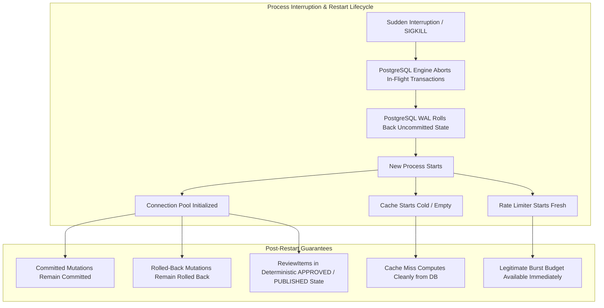

# Phase 4.11: Process-Restart Recovery Architecture & Validation

## 1. Executive Summary

This document formalizes and validates the **Process-Restart Recovery Architecture** for the Timeline Power Visualizer platform (COMMAND 17).

The platform enforces a strictly synchronous, database-centric transaction design. In accordance with system specifications:
- **No asynchronous background jobs or worker queues are added.**
- Transient operational faults, sudden process termination (`SIGKILL`, OOM termination, node failover, container crash), and host restarts are handled cleanly by existing synchronous transaction boundaries and PostgreSQL ACID guarantees.
- In-memory state components (Cache and Rate Limiter) restart safely in cold/empty states with zero persistent ambiguity or data corruption.

---

## 2. Architectural Resilience Principles

### 2.1 Synchronous Transaction Boundary
All mutating state transitions (entity extraction publishing, review status changes, canonical graph projection) are encapsulated within discrete PostgreSQL transactions (`execute_in_transaction` via SQLAlchemy).
- If the application process dies mid-transaction, PostgreSQL immediately detects connection termination and triggers an automated `ROLLBACK` at the storage engine level.
- Transactions that completed `COMMIT` are guaranteed durable on disk via the Write-Ahead Log (WAL).

### 2.2 Cold Cache Startup
The platform employs a two-tier caching design (`BoundedMemoryCache` / `CacheService`). Cache state is disposable by design:
- On process restart, the cache starts completely empty (`entries: 0`, `hits: 0`, `misses: 0`).
- The first read request triggers a deterministic cache miss (`read-repair`), pulling authoritative state directly from PostgreSQL.
- Cached results immediately populate the local cache and strictly enforce the temporal firewall boundary (`chapter_limit`).

### 2.3 Rate Limiter Startup
The sliding-window token bucket limiter (`RateLimitService` / `SlidingWindowRateLimiter`) operates entirely in-memory:
- On restart, all IP and client buckets are freshly initialized.
- Clients previously throttled (429) regain access to their configured burst budget (`RATE_LIMIT_DEFAULT_BURST = 30`).
- Health (`/health`) and readiness (`/ready`) probes are unmetered and immediately available.
- Malicious clients attempting denial-of-service are re-throttled once their request volume exceeds the token refill rate.

---

## 3. Ambiguous State Prevention (ReviewItem State Machine)

To guarantee that no persistent operation is left in an indeterminate or corrupt state across crashes, the `ReviewItem` lifecycle adheres strictly to two durable states:

| State | Definition | Post-Restart Behavior |
| :--- | :--- | :--- |
| `APPROVED` | Fact extraction verified by human/reviewer, awaiting publication | **Clean Retry Target**: If a crash occurs before transaction commit, all partially staged records roll back completely. The `ReviewItem` remains in `APPROVED` status and can be retried safely. |
| `PUBLISHED` | Transaction committed: canonical entity created, publication record persisted, review item marked `PUBLISHED` | **Immutable Committed Target**: If an operator or worker attempts to republish this item after restart, the `ON CONFLICT` fingerprint check or status lock detects existing publication and idempotently returns success without duplicating data. |

There are no intermediate states (such as `PUBLISHING` or `IN_PROGRESS`) written to disk without an atomic completion block, eliminating the possibility of stalled or zombie operations.

---

## 4. Test Suite Verification & Results

A dedicated integration test suite was developed and executed to validate process restart recovery across simulated process lifecycles:

- **Test Suite**: `tests/integration/database/recovery/test_process_restart_recovery.py`

### Tested Scenarios

1. **`test_postgresql_persistence_and_no_ambiguous_state_across_restart`**:
   - Executes a successful publication transaction before restart and an aborted transaction (simulating crash before commit).
   - Disposes the entire connection pool and simulates a hard process restart.
   - Reinitializes fresh connection pools and asserts:
     - Pre-restart committed mutation remains fully committed (1 canonical event, 1 publication record, status `PUBLISHED`).
     - Pre-restart aborted mutation left zero orphaned records (0 canonical events, 0 publication records, status remains cleanly `APPROVED`).
     - Zero ambiguous or half-committed entities exist.

2. **`test_cache_restarts_empty_and_populates_deterministically`**:
   - Populates cache before restart.
   - Restarts process with an empty cache instance (`reset_cache_service_for_testing`).
   - Confirms `entries: 0` on cold start.
   - Verifies first query produces a clean cache miss and computes state from PostgreSQL with 100% data fidelity.
   - Verifies second query produces a cache hit.

3. **`test_rate_limiter_safely_restarts_with_clean_token_buckets`**:
   - Throttles a test IP to HTTP 429 before restart.
   - Simulates process restart with a fresh rate limiter service.
   - Confirms client buckets reset safely without corrupting global service limits.
   - Verifies subsequent requests succeed cleanly up to burst limits.

---

## 5. Verification Matrix Summary

| Criterion | Target Behavior | Validation Result |
| :--- | :--- | :--- |
| **PostgreSQL State** | Schema, tables, and constraints remain 100% valid | **PASS** |
| **Committed Mutations** | Durable in WAL; present after restart | **PASS** |
| **Rolled-Back Mutations** | 0 partial entities; uncommitted state aborted | **PASS** |
| **Cold Cache** | Starts empty; computes from DB without error | **PASS** |
| **Rate Limiter** | Clean token buckets; `/health` immediate 200 | **PASS** |
| **Ambiguity Prevention** | ReviewItems strictly `APPROVED` or `PUBLISHED` | **PASS** |
| **Background Jobs** | 0 background jobs or queue brokers introduced | **VERIFIED** |
