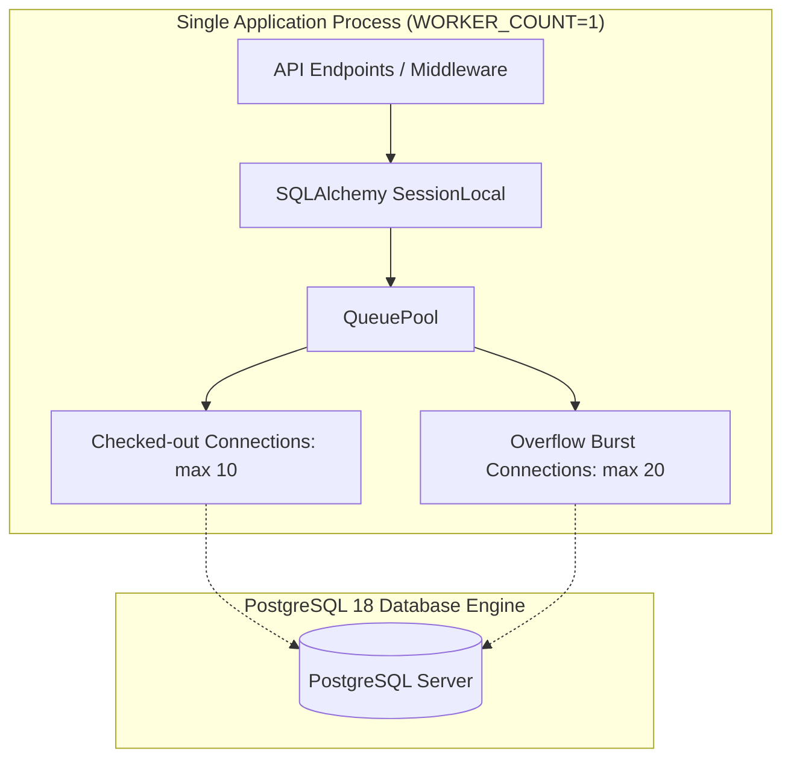

# Phase 4.12: Database Production Configuration & Pool Sizing Policy

## 1. Overview

This document specifies the PostgreSQL 18 production configuration, connection pooling bounds, transaction assumptions, and operational policies for the Timeline Power Visualizer platform.

---

## 2. Connection Pool Architecture

The database connection layer (`apps/api/app/dependencies/database.py`) uses SQLAlchemy's `QueuePool` with psycopg binary drivers.



### 2.1 Pool Sizing Parameters

| Parameter | Default Value | Recommended Production Value | Description |
| :--- | :--- | :--- | :--- |
| `DB_POOL_SIZE` | `10` | `10` | Baseline persistent connection pool size maintained by the process. |
| `DB_MAX_OVERFLOW` | `20` | `10` – `20` | Maximum temporary connections created during traffic bursts beyond pool size. |
| `DB_POOL_TIMEOUT_SECONDS` | `30` | `30` | Seconds to wait before raising a connection acquisition timeout exception. |
| `DB_POOL_RECYCLE_SECONDS` | `1800` | `1800` (30 min) | Frequency to discard and recreate connections, avoiding stale state or proxy kills. |
| `DB_POOL_PRE_PING` | `True` | `True` | Executes a lightweight `SELECT 1` ping before issuing connections from pool to catch disconnected sockets. |

---

## 3. Database Connection Bounds & Multi-Worker Policy

### Single-Process Worker Bound
The platform architecture strictly enforces **`WORKER_COUNT=1`** for standard deployments leveraging the in-process cache and sliding-window rate limiter.

#### Maximum Connection Footprint Calculation:
$$\text{Max DB Connections} = \text{WORKER\_COUNT} \times (\text{DB\_POOL\_SIZE} + \text{DB\_MAX\_OVERFLOW}) + \text{Operational Margins}$$
$$\text{Max DB Connections} = 1 \times (10 + 20) + 5 = 35\text{ connections}$$

PostgreSQL 18 default `max_connections` is typically `100`. The 35-connection ceiling guarantees that:
- The application process never exhausts PostgreSQL connection slots.
- Sufficient free connection slots remain for administrative access, migrations (`alembic`), and backup scripts (`pg_dump`).

### Multi-Worker Sizing Warning
If `WORKER_COUNT` is increased in non-cache/non-rate-limited deployments, database pool size must be scaled down:
- Example with 4 workers: set `DB_POOL_SIZE=5` and `DB_MAX_OVERFLOW=5`, yielding $4 \times (5 + 5) = 40$ connections.

---

## 4. Statement & Transaction Timeout Assumptions

1. **Transactional Discipline**:
   All write mutations (`PublishReviewItemUseCase`) are executed within synchronous transaction blocks. Row locks (`SELECT FOR UPDATE`) are held only for the duration of the domain event projection and status update.
2. **Statement Timeout Recommendation**:
   In production PostgreSQL (`postgresql.conf` or user role):
   ```sql
   ALTER ROLE timeline_user SET statement_timeout = '15s';
   ALTER ROLE timeline_user SET idle_in_transaction_session_timeout = '30s';
   ```
   This prevents any accidental query stall or deadlocked connection from consuming resources indefinitely.

---

## 5. Startup Readiness & Shutdown Behavior

- **Readiness Check (`/ready`)**:
  Executes `SELECT 1` through the SQLAlchemy connection pool with safe exception handling. If PostgreSQL is down or unreachable, `/ready` returns HTTP 503 (`SERVICE_UNAVAILABLE`) without leaking database credentials or host details.
- **Graceful Shutdown**:
  Upon SIGTERM / process shutdown, the SQLAlchemy engine disposes the connection pool (`engine.dispose()`), closing all open socket descriptors cleanly.
