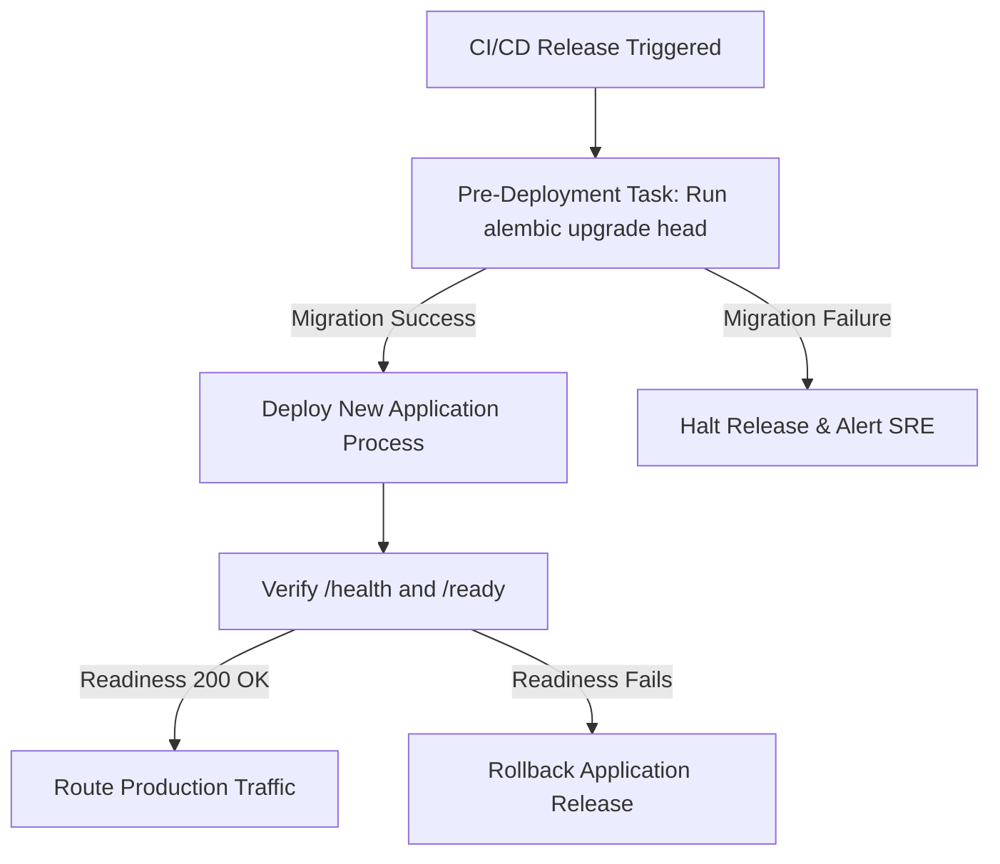

# Phase 4.12: Database Migration Startup Policy

## 1. Executive Directive

**The application process MUST NOT automatically execute database migrations (`alembic upgrade head`) during container bootstrap or application startup.**

---

## 2. Rationale & Architectural Failure Modes

Automatically executing migrations on application startup introduces severe operational hazards in production:

1. **Race Conditions & Schema Lock Contention**:
   If a rolling deployment boots a new replica while an existing replica is serving traffic, concurrent `alembic upgrade head` commands trigger table-level locks (`AccessExclusiveLock`) on PostgreSQL, causing query timeouts and application stalls.
2. **Partial Migration Failure on Node Crash**:
   If an application pod crashes or is terminated by an OOM-killer mid-migration, the database schema is left in a dirty or ambiguous state while downstream instances boot.
3. **Rollback Impossibility**:
   Automatic forward-migration couples schema upgrades directly to code execution, preventing zero-downtime rollbacks if an application container fails post-deployment health checks.

---

## 3. Production Deployment & Ordering Policy

In production environments, database migrations must be executed as an **independent, isolated pre-deployment release task**:



### Production Execution Protocol:
1. **Schema Step**: CI/CD runner executes migration independently:
   ```bash
   alembic upgrade head
   ```
2. **Verification Step**: Schema state is validated against migration revision tables.
3. **Application Step**: Once migration completes successfully, application instances are started:
   ```bash
   uvicorn apps.api.app.main:app --host 0.0.0.0 --port 8000 --workers 1
   ```
4. **Readiness Probe**: Kubernetes / Docker swarm / load balancer polls `/ready`. Once PostgreSQL connection test succeeds, traffic routing begins.
