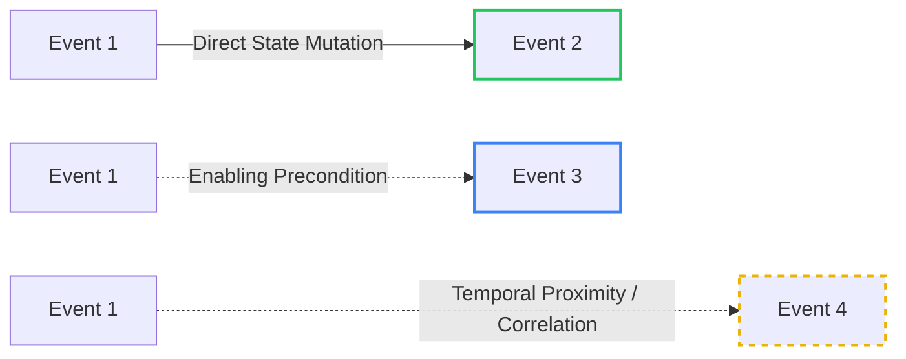

# Phase 5.0: Causal Intelligence Architecture & Causal Chain Model

## 1. Executive Summary

Causal Intelligence models the directional flow of narrative influence. Rather than treating events merely as chronological sequences, it tracks how the preconditions and consequences of events causally produce subsequent narrative outcomes.

---

## 2. Causality Classification Taxonomy

To prevent subjective or unverified assumptions, causal relationships are strictly classified into four formal tiers:



| Causal Link Type | Definition | Verification Criteria | Deterministic Grounding |
| :--- | :--- | :--- | :--- |
| **`DIRECT_CAUSATION`** | Event $A$ directly triggers or causes Event $B$. | Event $B$'s raw fact explicitly names Event $A$ as trigger, or $B$ is an immediate atomic consequence (e.g. attack $\rightarrow$ death). | Explicit provenance linkage in canonical extraction payload. |
| **`INDIRECT_INFLUENCE`** | Event $A$ produces a state change without which Event $B$ could not occur. | Event $A$ unlocks a skill/rank or creates a relationship that is a required precondition for Event $B$. | Verified via `WorldState` requirement checking. |
| **`NARRATIVE_CORRELATION`**| Events occur in temporal proximity involving shared actors. | Chronologically adjacent with entity overlap, but lacking formal precondition dependency. | Explicitly flagged as **Correlation**; NEVER reported as Proven Causation. |
| **`INFERRED_HYPOTHESIS`**| Plausible causal link inferred by analysis rules. | Modeled with an explicit confidence score $< 1.0$ and clear explanation. | Marked as analytical inference; distinguishable from canonical causation. |

---

## 3. Causal Chain Model

### 3.1 Causal Node & Edge
```python
@dataclass(frozen=True)
class CausalNode:
    event_id: str
    chapter: int
    event_type: str
    summary: str
    primary_entity_id: str


@dataclass(frozen=True)
class CausalEdge:
    source_event_id: str
    target_event_id: str
    link_type: CausalLinkType  # DIRECT, INDIRECT, CORRELATED
    confidence: float  # 1.0 for canonical, <1.0 for inferred
    explanation: str  # E.g., "Event 1 granted Rank A which was required for Event 2"
```

### 3.2 Causal Chain Aggregate
```python
@dataclass(frozen=True)
class CausalChain:
    root_event_id: str
    target_event_id: str
    reader_chapter: int
    nodes: list[CausalNode]
    edges: list[CausalEdge]
    total_depth: int
    is_direct: bool
```

---

## 4. Causal Tracing Algorithm

```text
Function TraceCausality(start_event_id, end_event_id, reader_chapter):
1. Assert start_event.chapter <= reader_chapter and end_event.chapter <= reader_chapter.
2. If start_event.chapter > end_event.chapter, return Error("Temporal violation: cause cannot follow effect").
3. Retrieve all events in interval [start_event.chapter, end_event.chapter].
4. Filter out any event with chapter > reader_chapter.
5. Initialize Directed Acyclic Graph (DAG) with start_event.
6. For each subsequent event E:
   a. Check explicit parent references in provenance.
   b. Check entity state dependency against impacts of preceding events via EventImpactAnalyzer.
   c. If direct dependency exists, add DIRECT_CAUSATION edge.
   d. Else if shared entity state was altered, add INDIRECT_INFLUENCE edge.
7. Find paths from start_event to end_event.
8. Return deterministic CausalChain.
```

---

## 5. Non-Hallucination & Provenance Guarantee

- Every `CausalEdge` must provide a concrete audit string explaining the specific state change or canonical extraction link that connects the two events.
- If no verifiable causal connection can be established, the system returns an empty causal path rather than inventing narrative bridges.
