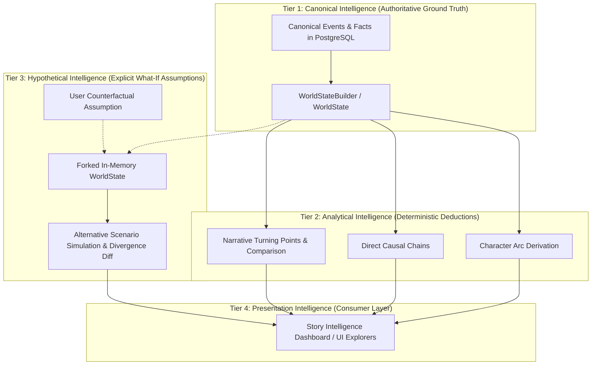

# Phase 5.0: Intelligence Layer Definition & Taxonomy

## 1. Executive Summary

"Advanced Story Intelligence" transforms verified temporal lore into explainable narrative insights, character trajectories, causal explanations, and counterfactual scenario exploration. To preserve mathematical rigor and prevent hallucination, the intelligence layer enforces a strict four-tier taxonomy.

---

## 2. Four-Tier Intelligence Taxonomy

### 2.1 Tier 1: Canonical Intelligence (Ground Truth)
- **Definition**: Raw, verified story occurrences extracted from text and published via human review into PostgreSQL.
- **Characteristics**: Immutable, chapter-ordered, backed by explicit `Provenance` (chapter number, scene location, character ID, extraction confidence).
- **Examples**: "Kim Dokja acquires White Pure Star Flag in Chapter 45", "Yoo Joonghyuk dies in 3rd regression".

### 2.2 Tier 2: Analytical Intelligence (Deterministic Deduction)
- **Definition**: Insights derived deterministically from canonical facts without speculative assumptions.
- **Characteristics**: 100% reproducible from canonical data. Zero probability of drift.
- **Components**:
  - **Character Arcs**: Trajectory of rank transitions, affiliation shifts, ability gains, and relationship swings.
  - **Causal Chains**: Step-by-step causal tracing where Event $A$ directly mutated state that triggered or enabled Event $B$.
  - **Narrative Milestones**: Turning points computed via state divergence metrics (`WorldStateComparator`).

### 2.3 Tier 3: Hypothetical Intelligence (Counterfactual Exploration)
- **Definition**: Speculative "What-If" scenarios generated by altering an explicit canonical assumption and replaying the narrative model forward.
- **Characteristics**:
  - Forked in application memory; **NEVER** persisted to canonical storage.
  - Distinctly branded and serialized with `is_hypothetical: true` and explicit confidence ratings.
  - Evaluates divergence: $\Delta(Canonical, Hypothetical)$.
- **Example**: "What if character $X$ survived Chapter 20?" $\rightarrow$ Re-evaluate faction balance and subsequent event viability at Chapter 50.

### 2.4 Tier 4: Presentation Intelligence (Exploration & Visual Synthesis)
- **Definition**: How canonical, analytical, and hypothetical insights are aggregated, filtered, and rendered.
- **Characteristics**: Enforces the `readerChapter` spoiler firewall at the view boundary. Clearly visually demarcates canonical facts from hypothetical branches.

---

## 3. Strict Distinguishability Invariants

1. **Anti-Hallucination Invariant**: No analytical or hypothetical result may exist without a direct reference graph back to Tier 1 canonical events.
2. **Immutable Boundary Invariant**: An analytical or hypothetical calculation must never execute a SQL `INSERT`, `UPDATE`, or `DELETE` on canonical event, character, or relationship tables.
3. **Temporal Invariant**: For any evaluation at $readerChapter = N$, Tiers 1, 2, 3, and 4 are strictly barred from evaluating or referencing data $> N$.
