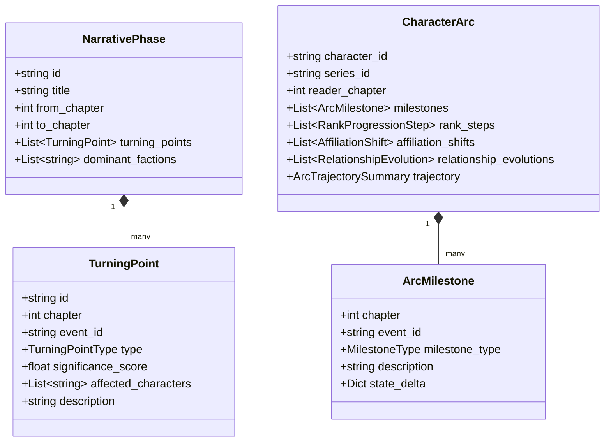

# Phase 5.0: Narrative Intelligence & Character Arc Domain Architecture

## 1. Executive Summary

Narrative Intelligence models the temporal trajectory of story elements across time. It extracts progression, turning points, narrative phases, and relationship dynamics directly from sequences of `WorldState` deltas and canonical events.

---

## 2. Narrative Intelligence Domain Model



---

## 3. Core Domain Entities & Value Objects

### 3.1 Character Arc Aggregate (`CharacterArc`)
- **Entity Identity**: Rooted by `(series_id, character_id, reader_chapter)`.
- **Invariants**:
  1. All milestones must satisfy: $chapter \le reader\_chapter$.
  2. All events and state transitions must be verified canonical occurrences.
  3. Milestones must be strictly sorted by `(chapter, sequence)`.

### 3.2 Turning Point Entity (`TurningPoint`)
- **Types**:
  - `STATUS_CHANGE`: Character death, resurrection, or transformation.
  - `POWER_BREAKTHROUGH`: Significant rank transition or skill evolution.
  - `FACTION_REALIGNMENT`: Betrayal, defection, or leadership ascension.
  - `RELATIONSHIP_RUPTURE`: Shift from ally to enemy or nemesis.
- **Significance Metric**:
  Calculated deterministically from the volume and magnitude of direct and derived impacts produced by `EventImpactAnalyzer`.

### 3.3 Narrative Phase Entity (`NarrativePhase`)
- **Definition**: Cohesive blocks of chapters characterized by stable faction dominance, central conflict themes, and bounded by major turning points (e.g., "The Subjugation Arc: Ch 15–35").

---

## 4. Derivation Algorithm (Deterministic & Pure)

```text
Given: series_id, character_id, reader_chapter

1. Fetch all canonical EventEnvelopes for character_id where chapter <= reader_chapter.
2. Sort deterministically using sort_events(envelopes).
3. Compute initial state: WorldState(chapter=1).
4. Iterate through events sequentially:
   a. Check for status mutations (death/resurrection).
   b. Check for rank changes (RankTransition).
   c. Check for skill acquisitions/evolutions.
   d. Check for relationship delta (ally, enemy, neutral).
   e. If delta severity exceeds threshold, record ArcMilestone.
5. Aggregate trajectory metrics (growth rate, adversity count, survival duration).
6. Return immutable CharacterArc aggregate.
```

---

## 5. Temporal Safety Guarantee

- **Pre-Filtering**: The event stream is filtered by `chapter <= reader_chapter` **before** any arc calculation occurs.
- **No Forward Peeking**: Trajectory summaries only score developments known up to `reader_chapter`. Future allegiances or betrayals remain 100% invisible.
