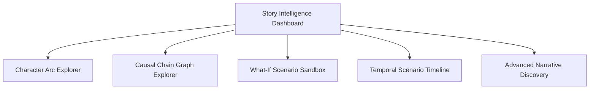
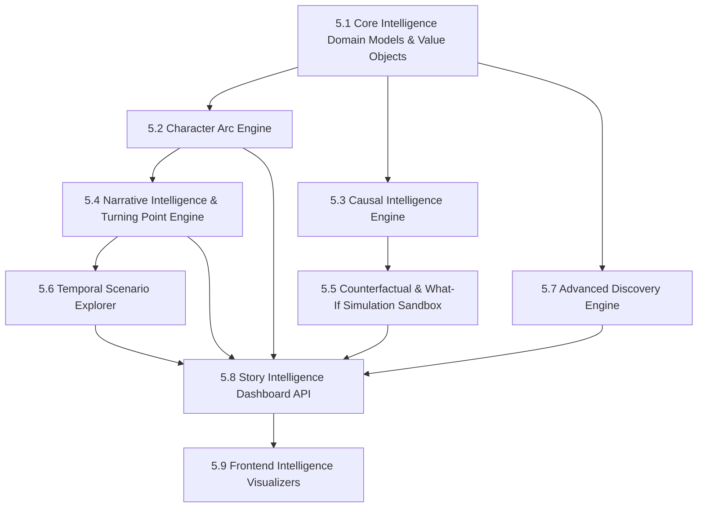

# Phase 5.0: Operational Integration (Performance, Caching, Rate Limiting, API, Frontend, Risks)

## 1. Computational Complexity & Performance Model

| Intelligence Engine | Computational Complexity | Primary Risk | Mitigation & Optimization |
| :--- | :--- | :--- | :--- |
| **Character Arc Derivation** | $O(E_{\text{char}} \log E_{\text{char}})$ | High event count for protagonist. | Indexed query on `(series_id, subject_id, chapter)`; sequential in-memory scan. |
| **Causal Chain Tracing** | $O(V + E)$ in chapter interval | Multi-branch graph traversal. | Bounded traversal depth (`max_depth=5`); cycle detection. |
| **Counterfactual Replay** | $O(E_{\Delta} \times \text{apply})$ | Replaying hundreds of chapters forward. | Bounded branch duration; max chapter range cap ($|N - \text{target}| \le 50$). |
| **Temporal Scenarios** | $O(K \times \text{compare})$ | Comparing $K$ snapshots. | Limit max snapshots ($K \le 5$); reuse cached `WorldState`. |
| **Advanced Discovery** | $O(C \times \text{predicates})$ | Filtering candidate characters $C$. | SQL pre-filtering on indexed fields + in-memory predicate check on top candidates. |

---

## 2. Caching Compatibility & Key Structure

All Phase 5 analytical operations are purely deterministic functions of immutable canonical state. They are fully compatible with Phase 4.8's `BoundedMemoryCache`.

### Cache Key Formats:
- **Character Arc**: `arc:{version}:{series_id}:{character_id}:{reader_chapter}`
- **Causal Chain**: `causal:{version}:{series_id}:{root_id}:{target_id}:{reader_chapter}`
- **Counterfactual**: `cf:{version}:{series_id}:{assumption_hash}:{reader_chapter}`
- **Scenario**: `scen:{version}:{series_id}:{sorted_milestones_hash}:{reader_chapter}`
- **Discovery**: `disc:{version}:{series_id}:{query_hash}:{reader_chapter}:{page}`

*Invalidation Rule*: Any publication mutation in `series_id` automatically triggers `invalidate_series(series_id)`, cleanly purging all analytical cache keys for that tenant.

---

## 3. Rate Limiting Classification (Phase 4.9 Compatibility)

| Endpoint Path | Method | Assigned Tier | Rationale |
| :--- | :--- | :--- | :--- |
| `/api/v1/series/{id}/intelligence/character-arc/{char_id}` | `GET` | **EXPENSIVE_READ** (30/min, burst 10) | Multi-event delta evaluation. |
| `/api/v1/series/{id}/intelligence/causal-chain` | `GET` | **EXPENSIVE_READ** (30/min, burst 10) | Graph dependency traversal. |
| `/api/v1/series/{id}/intelligence/counterfactual` | `POST` | **EXPENSIVE_READ** (30/min, burst 10) | Forked in-memory replay (read-only computation). |
| `/api/v1/series/{id}/intelligence/scenario-explorer` | `POST` | **EXPENSIVE_READ** (30/min, burst 10) | Multi-snapshot comparison. |
| `/api/v1/series/{id}/intelligence/discovery` | `POST` | **EXPENSIVE_READ** (30/min, burst 10) | Compound predicate filtering. |
| `/api/v1/series/{id}/intelligence/dashboard` | `GET` | **EXPENSIVE_READ** (30/min, burst 10) | Narrative summary aggregation. |

---

## 4. Proposed API Surface

```text
GET  /api/v1/series/{series_id}/intelligence/character-arc/{char_id}?reader_chapter=N
GET  /api/v1/series/{series_id}/intelligence/causal-chain?from_event=ID&to_event=ID&reader_chapter=N
POST /api/v1/series/{series_id}/intelligence/counterfactual
POST /api/v1/series/{series_id}/intelligence/scenario-explorer
POST /api/v1/series/{series_id}/intelligence/discovery
GET  /api/v1/series/{series_id}/intelligence/dashboard?reader_chapter=N
```

---

## 5. Frontend Capability Map (Phase 5 UI Surfaces)



1. **Character Arc Explorer**: Visual trajectory curves displaying rank milestones, faction loyalty shifts, and turning point cards.
2. **Causal Chain Explorer**: Interactive DAG highlighting direct causal links vs indirect narrative influences with provenance badges.
3. **What-If Scenario Sandbox**: Split-screen diff comparing canonical timeline against the hypothetical branch with visual divergence markers.
4. **Temporal Scenario Timeline**: Multi-point historical scrubber showing world state evolutions between selected chapters.
5. **Advanced Narrative Discovery**: Structured predicate builder ("Find characters who...") with instant spoiler-safe matching.

---

## 6. Implementation Dependency Graph



---

## 7. Architecture Risk Register

| Risk | Severity | Likelihood | Mitigation Strategy | Detection Strategy |
| :--- | :--- | :--- | :--- | :--- |
| **Temporal Spoiler Leakage** | **CRITICAL** | Low | Hard boundary validator: clamp and filter all event/entity inputs by `chapter <= readerChapter` before processing. | Automated triad unit tests ($N-1, N, N+1$). |
| **Hypothetical State Contamination** | **CRITICAL** | Low | Sandboxed execution: counterfactuals run strictly in-memory using deep-cloned states without DB write handles. | DB assertion: zero mutation during What-If tests. |
| **Combinatorial Replay Explosion** | **HIGH** | Medium | Cap maximum counterfactual forward-replay horizon to 50 chapters per query. | Benchmark testing; reject excessive chapter ranges with 400. |
| **Graph vs Source-of-Truth Drift** | **HIGH** | Low | Strict invariant: Knowledge Graph is always a projection of `WorldState`, never an authoritative store. | Architecture linting & unit tests. |
| **Non-Deterministic Outputs** | **MEDIUM** | Low | Mandatory sorting on all returned collections by `(chapter, sequence, id)`. | Determinism regression tests. |
