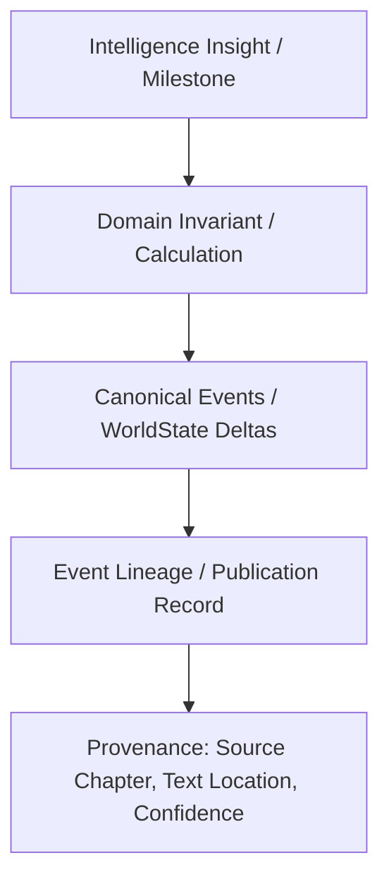

# Phase 5.0: Intelligence Provenance, Temporal Firewall, and Determinism Model

## 1. Intelligence Provenance & Explainability

Every analytical or hypothetical intelligence result emitted by the platform must be directly traceable back to canonical evidence.

### 1.1 Traceability Structures
- **Canonical Insight**: Points directly to a sequence of `(event_id, chapter_number, provenance)`.
- **Hypothetical Insight**: Points to `(assumption_id, divergence_delta)` grounded in the pre-branch canonical state.

---

## 2. Temporal Firewall for Intelligence ($N-1, N, N+1$)

The `readerChapter = N` boundary remains an absolute security gate across all Phase 5 intelligence engines:

| Intelligence Dimension | Behavior at $Chapter \le N$ | Behavior at $Chapter > N$ (Strictly Prohibited) |
| :--- | :--- | :--- |
| **Character Arcs** | Milestones, rank gains, and deaths up to chapter $N$ are analyzed. | Future deaths, rank breakthroughs, and betrayals are **100% excluded** from the arc. |
| **Causal Chains** | Causal steps occurring at or before chapter $N$ are traceable. | Future causal consequences $> N$ are **never computed or exposed**. |
| **Counterfactuals** | Assumptions and alternative replays are bounded within $[1, N]$. | Assumptions cannot alter future events; replay stops at chapter $N$. |
| **Scenarios** | Snapshot comparisons only permit milestones $\le N$. | Requesting a snapshot at $N+1$ raises HTTP 400 `INVALID_CHAPTER`. |
| **Discovery** | Compound search predicates only evaluate states up to $N$. | Candidate entities introduced at $> N$ are dropped from result sets. |

---

## 3. Mathematical Determinism Contract

Given identical inputs, every intelligence engine must return identical, byte-for-byte consistent results:

$$\text{Result} = f(\text{series\_id}, \text{readerChapter}, \text{query\_params}, \text{canonical\_data\_version})$$

### Determinism Rules:
1. **Sorted Collections**: All internal entity dictionaries, milestone lists, and causal edges are explicitly sorted by `(chapter, sequence, id)` before serialization.
2. **Zero Randomness**: No probabilistic sampling, randomized tie-breakers, or non-deterministic heuristics are permitted.
3. **Floating-Point Precision**: Confidence scores and metrics are rounded to standard decimal places (e.g. 4 decimals).
4. **Time-Independence**: Calculations rely solely on chapter numbers and domain event sequences, never `datetime.now()` or host system clocks.
