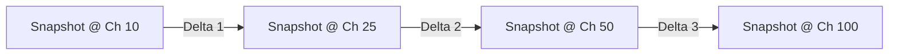

# Phase 5.0: Temporal Scenario & Advanced Discovery Architecture

## 1. Overview & Objectives

This document defines the architecture for:
1. **Temporal Scenario Exploration**: Multi-point historical world state inspection and cross-milestone divergence tracking.
2. **Advanced Discovery**: Complex, compound narrative querying without requiring natural language LLMs or speculative graph databases.

---

## 2. Temporal Scenario Model

### 2.1 Multi-Point Inspection
Allows a reader to define an arbitrary ordered sequence of chapter horizons (e.g. $[10, 25, 50, 100]$ bounded by $readerChapter$) and analyze the progression of characters, factions, and relationships across those milestones.



### 2.2 Domain Entities
```python
@dataclass(frozen=True)
class ScenarioSnapshot:
    chapter: int
    world_state_summary: dict
    active_characters_count: int
    dominant_factions: list[str]


@dataclass(frozen=True)
class TemporalScenarioSeries:
    series_id: str
    reader_chapter: int
    milestones: list[int]
    snapshots: list[ScenarioSnapshot]
    transitions: list[TemporalComparison]  # Computed via WorldStateComparator
```

---

## 3. Advanced Discovery Model (Deterministic Compound Querying)

### 3.1 Compound Narrative Predicates
Supports queries such as:
> *"Find characters allied with Character A at Chapter 20 who joined Faction B by Chapter 40 and acquired Rank S before Chapter 60."*

### 3.2 Query Specification AST
```python
class DiscoveryClauseType(StrEnum):
    RELATIONSHIP_MATCH = "RELATIONSHIP_MATCH"  # source, target, rel_type, as_of_chapter
    FACTION_MEMBER = "FACTION_MEMBER"  # character_id, faction_id, as_of_chapter
    RANK_REACHED = "RANK_REACHED"  # character_id, system_id, min_rank, as_of_chapter
    EVENT_PARTICIPATION = (
        "EVENT_PARTICIPATION"  # character_id, event_type, chapter_range
    )
    STATE_TRANSITION = (
        "STATE_TRANSITION"  # from_state -> to_state between Ch_A and Ch_B
    )


@dataclass(frozen=True)
class DiscoveryClause:
    clause_type: DiscoveryClauseType
    parameters: dict


@dataclass(frozen=True)
class AdvancedDiscoveryQuery:
    series_id: str
    reader_chapter: int
    clauses: list[DiscoveryClause]
    match_mode: str = "ALL"  # ALL (AND) or ANY (OR)
    page: int = 1
    page_size: int = 20
```

### 3.3 Execution Engine
1. **Spoiler Horizon Clamping**: Every clause containing an `as_of_chapter` or `chapter_range` is validated against $reader\_chapter$. Clauses with chapters $> reader\_chapter$ are rejected or clamped.
2. **Deterministic Evaluation**: Evaluates candidates by querying candidate characters from the repository and applying predicate evaluators against the materialized `WorldState` snapshots at the specified milestone chapters.
3. **Paging & Sorting**: Results are sorted deterministically by `(match_score, character_name, character_id)`.
